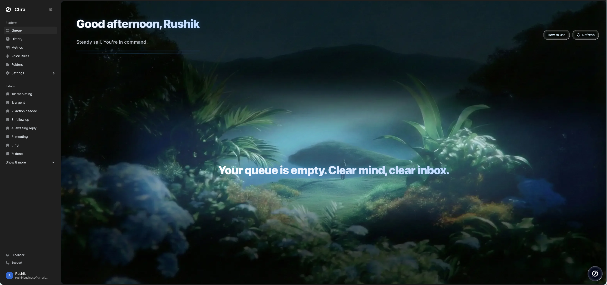
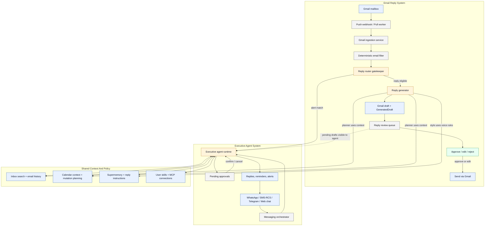
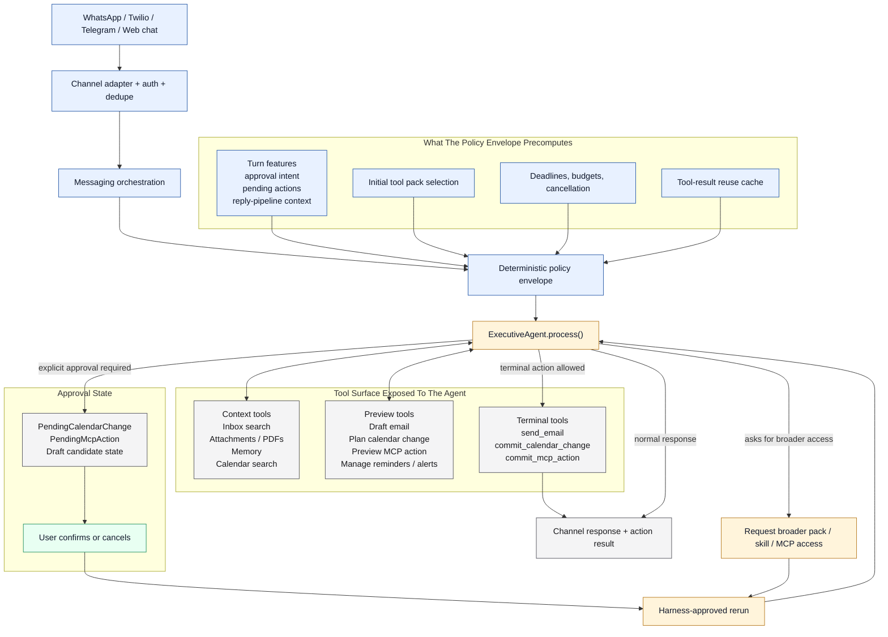
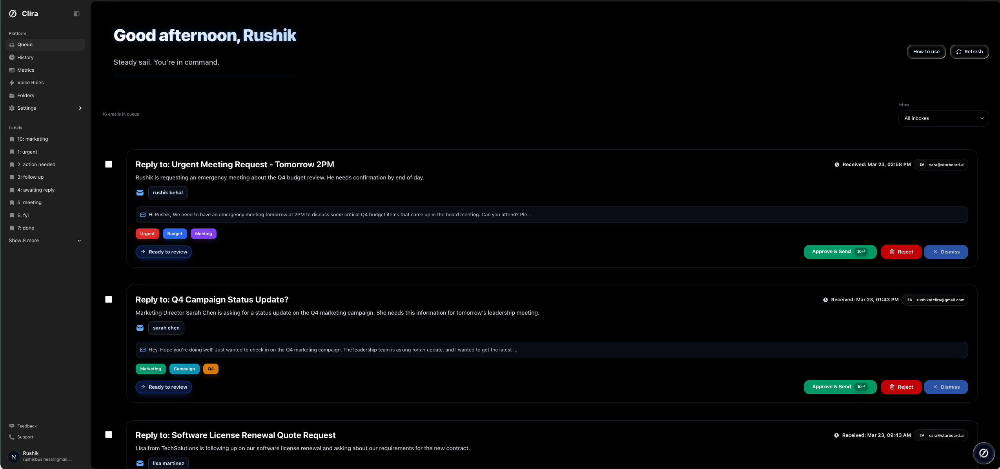
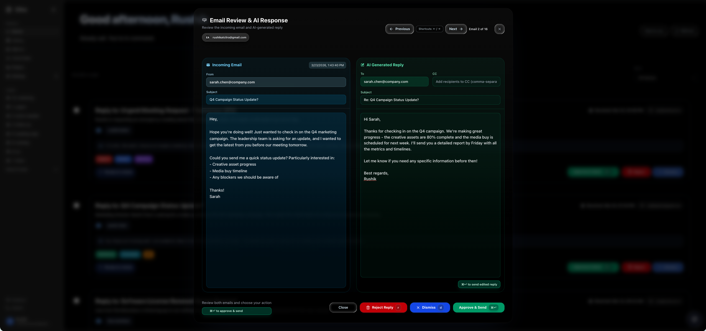

<p align="center">
  <a href="https://tryclira.com">
    
  </a>
</p>

<h1 align="center">Clira - Your AI chief of staff. Always on, never unsupervised.</h1>

<p align="center">
  Self-hosted AI email assistant for draft-first workflows, deterministic filtering, and worker-driven reply generation.
</p>

<p align="center">
  <a href="https://tryclira.com"><strong>Website</strong></a>
  ·
  <a href="docs/self-host.md"><strong>Self-Host</strong></a>
  ·
  <a href="docs/setup.md"><strong>Contributor Setup</strong></a>
  ·x
  <a href="docs/architecture.md"><strong>Architecture</strong></a>
  ·
  <a href="https://github.com/Rushik-B/Clira/issues"><strong>Issues</strong></a>
</p>

<p align="center">
  <a href="https://github.com/Rushik-B/Clira/actions/workflows/ci.yml">
    
  </a>
  <a href="https://github.com/Rushik-B/Clira/blob/main/package.json">
    
  </a>
  <a href="https://github.com/Rushik-B/Clira/pkgs/container/clira">
    
  </a>
  <a href="https://github.com/Rushik-B/Clira/blob/main/LICENSE">
    
  </a>
  <a href="https://github.com/Rushik-B/Clira/blob/main/package.json">
    
  </a>
</p>

Clira is an email-first assistant built for people who want AI help without giving up control. It organizes inbound mail, drafts replies, keeps deterministic filters ahead of generation, and separates UI, ingestion, and worker execution so self-hosting remains inspectable and reliable.

## Highlights

- Draft-first queue with human review before send
- Gmail ingestion in push and pull modes
- Deterministic filtering before reply generation
- Worker-based architecture for ingestion, planning, and async jobs
- Self-hostable stack with Docker Compose and GHCR images

## Architecture At A Glance

Clira is easiest to understand as two tightly connected systems: a draft-first email reply pipeline, and a multi-channel executive agent that can act on inbox, calendar, memory, and messaging context without bypassing approvals.



### Reply Pipeline

This path is intentionally strict: deterministic filtering first, then a schema-validated LLM gate, then a planner/style split where the style stage is not allowed to add facts.

```mermaid
flowchart LR
  classDef deterministic fill:#e8f1ff,stroke:#2457a6,color:#0f172a,stroke-width:1px;
  classDef model fill:#fff4db,stroke:#b7791f,color:#0f172a,stroke-width:1px;
  classDef human fill:#e8fff2,stroke:#1f8f5f,color:#0f172a,stroke-width:1px;
  classDef store fill:#f4f4f5,stroke:#52525b,color:#18181b,stroke-width:1px;

  incoming["Incoming Gmail event"]
  persist["Persist email + thread state"]
  hardfilter["1. Deterministic filter"]
  router["2. Reply router agent"]
  alerts["Alert notification trigger"]
  planner["3. Reply planner agent"]
  planctx["Thread history<br/>Direct email history<br/>Keyword history<br/>Memory<br/>Calendar context"]
  plan["Structured reply plan"]
  style["4. Style agent"]
  stylectx["Master prompt<br/>Style instructions<br/>Sent-mail examples"]
  finalreply["Final reply JSON"]
  draft["Create Gmail draft"]
  queue["Queue review UI"]
  human["Human approval"]
  send["Send / reject / dismiss"]

  incoming --> persist --> hardfilter
  hardfilter -->|pass| router
  hardfilter -->|block| stop["Stop safely"]
  router -->|alert match| alerts
  router -->|draft reply| planner
  router -->|no reply| stop
  planctx --> planner --> plan --> style --> finalreply --> draft --> queue --> human --> send
  stylectx --> style

  class incoming,persist,hardfilter,draft,queue,alerts,send deterministic
  class router,planner,style model
  class human human
  class planctx,stylectx,plan,finalreply,stop store
```

### Executive Agent Runtime

The executive agent is not just "chat with tools." It runs inside a deterministic policy envelope that decides what tools can exist, when the agent must pause for approval, and when a rerun is allowed with broader capabilities.



## Product Views



_Queue view with actionable drafts_



_Reply review modal before approval_

## Fast Self-Host

This is the default launch path. It assumes Docker and Docker Compose are installed.

1. Clone the repo and copy the environment template.

```bash
cp .env.example .env
```

2. Initialize local runtime state and generated secrets.

```bash
npm run selfhost:init
```

If you do not want to use `npm`, run `bash scripts/selfhost-init.sh` directly.

3. Configure Gmail Pub/Sub and write the generated values back into `.env`.

```bash
npm run setup:google -- --project-id YOUR_PROJECT_ID --mode pull --write-env
```

4. Fill in the remaining required values in `.env`.

- `GOOGLE_CLIENT_ID`
- `GOOGLE_CLIENT_SECRET`
- your AI provider key

5. Pull and start the default launch stack.

```bash
npm run selfhost:up
```

6. Open Clira.

- App: [http://localhost:13000](http://localhost:13000)
- Liveness: [http://localhost:13000/api/health](http://localhost:13000/api/health)
- Deep readiness: [http://localhost:13000/api/health?deep=1](http://localhost:13000/api/health?deep=1)

## Image Tags

Clira publishes two kinds of image tags:

- `main` and `sha-<commit>` for continuous builds from the `main` branch
- `vX.Y.Z`, `vX.Y`, and `latest` for release tags such as `v0.1.0`

For evaluation and internal testing, the default `CLIRA_IMAGE=ghcr.io/rushik-b/clira:main` is fine.
For production or any install you want to keep stable, pin `CLIRA_IMAGE` to an exact release tag in `.env`.

## What Starts By Default

`npm run selfhost:up` starts the `core` profile:

- `app`
- `worker`
- `gmail-pull-worker`
- `cron`
- `db`
- `redis`

`backfill-worker` is intentionally not part of the default launch profile. Add it only when you want inbox search backfill:

```bash
npm run selfhost:up:full
```

## Required Environment Values

Minimum first-run values live at the top of [`.env.example`](.env.example). The important ones are:

- `APP_PUBLIC_URL`
- `NEXTAUTH_SECRET`
- `CRON_SECRET`
- `EMAIL_ENCRYPT_SECRET`
- `EMAIL_ENCRYPT_SALT`
- `GOOGLE_CLIENT_ID`
- `GOOGLE_CLIENT_SECRET`
- `GMAIL_PUBSUB_TOPIC`
- `GMAIL_PUBSUB_PULL_SUBSCRIPTION`
- `GOOGLE_APPLICATION_CREDENTIALS`
- `AI_PROVIDER`
- provider auth for the selected model backend

Clira stores local runtime secrets under `.clira-runtime/`. The default Gmail service-account file path is `./.clira-runtime/google-service-account.json`.

## Self-Host Commands

| Command | What it does |
| --- | --- |
| `npm run selfhost:init` | Creates `.env` if missing, generates secrets, creates `.clira-runtime`, and runs diagnostics |
| `npm run selfhost:doctor` | Read-only diagnostics for env, Docker, ports, Gmail credentials, and AI provider config |
| `npm run selfhost:up` | Pulls and starts the default `core` self-host profile |
| `npm run selfhost:up:full` | Pulls and starts `core` plus `backfill-worker` |
| `npm run selfhost:down` | Stops the self-host stack |
| `npm run selfhost:logs` | Tails the main self-host services |
| `npm run setup:google` | Provisions Gmail Pub/Sub resources and optional `.env` updates |

## Contributor Workflow

If you are developing Clira rather than just hosting it, use [`docs/setup.md`](docs/setup.md). That doc covers:

- local `npm run dev`
- worker processes in separate terminals
- local builds with `docker-compose.dev.yml`
- contributor-oriented verification

## AI Provider Notes

Google remains the default provider. The OpenRouter env names are still used for compatibility, but `OPENROUTER_BASE_URL` can point at any OpenAI-compatible endpoint. That includes OpenRouter, LM Studio, vLLM, and similar gateways. Details live in [`docs/ai-providers.md`](docs/ai-providers.md).

## Documentation

- Self-host guide: [`docs/self-host.md`](docs/self-host.md)
- Contributor setup: [`docs/setup.md`](docs/setup.md)
- Architecture: [`docs/architecture.md`](docs/architecture.md)
- Gmail Pub/Sub: [`docs/gmail-pubsub.md`](docs/gmail-pubsub.md)
- AI providers: [`docs/ai-providers.md`](docs/ai-providers.md)
- Troubleshooting: [`docs/troubleshooting.md`](docs/troubleshooting.md)
- Operations: [`docs/operations.md`](docs/operations.md)
- Full docs index: [`docs/README.md`](docs/README.md)
